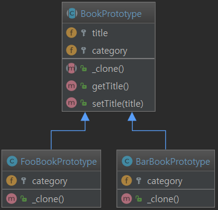
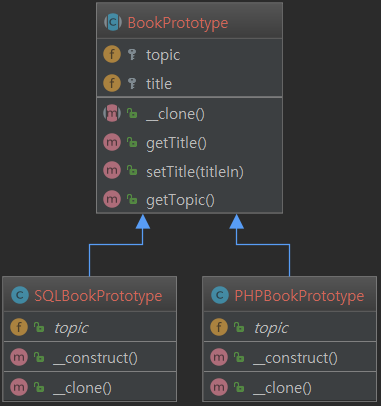

Prototype Pattern - 원형 패턴
======================

> - Type : Creational
> - Intent : Specify the kinds of objects to create using a prototypical instance, and create new objects by copying this prototype.

## 의도
- 일반적으로 사용하는 객체 생성(new Foo())의 비용을 피하기 위해서 사용합니다. 그리고 그 대신에 프로토타입을 생성하고 그것을 복제(clone) 합니다.
즉, 원형이 되는(prototypical) 인스턴스를 사용하여 생성할 객체의 종류를 명시하고, 이렇게 만든 견본을 복사해서 새로운 객체를 생성합니다.
- 다수의 객체 생성시에 발생되는 객체의 생성 비용을 효과적으로 줄일 수 있습니다.
- new 를 사용하여 객체를 생성 하는것이 비용이 크거나, 기존의 객체와 비슷하지만 일부만 변경된 객체를 사용하는 경우 사용할 수 있습니다.
- 공대여자 왈
  + A객체를 복사해서 A'를 만들고 A'라는 새로운 객체를 만드는 것, A와 A'는 서로관에 연관성이 없느 독립된 객체들이다.
  + 버튼을 만들 때 O버튼을 만들고 그걸 복사해서 변수만 바꿔서 X라는 버튼을 만드는 것

## 장점
- 클라이언트에서는 새로운 인스턴스를 만드는 복잡한 과정을 몰라도 됩니다.
- 클라이언트에서는 구체적인 형식을 모르더라도 객체를 생성할 수 있습니다.
- 상황에 따라서 객체를 새로 생성하는 것보다 객체를 복사하는 것이 더 효율적일 수 있습니다.

## 단점
- 때때로 객체의 복사본을 만드는 일이 매우 복잡한 경우가 있다는 단점이 있습니다.

## Example01
많은 양의 데이터. (이를테면, ORM을 통해 데이터베이스에서 한번에 1,000,000줄을 생성할 때.)

### UML


### output of index.php
```
Foo Book No0
Foo Book No1
Foo Book No2
Foo Book No3
Foo Book No4
Bar Book No0
Bar Book No1
Bar Book No2
Bar Book No3
Bar Book No4
```

## Example02
두 개의 구체적이거나 구체적인 서브 클래스 인 PHPBookPrototype과 SQLBookPrototype 있는 추상 BookPrototype 클래스를 사용합니다.
PHPBookPrototype 또는 SQLBookPrototype을 사용하여 객체를 생성하려면 clone 메소드를 호출합니다.

### UML


### output of index.php
```
BEGIN TESTING PROTOTYPE PATTERN

Book 1 topic: SQL
Book 1 title: SQL For Cats

Book 2 topic: PHP
Book 2 title: OReilly Learning PHP 5

Book 3 topic: SQL
Book 3 title: OReilly Learning SQL

END TESTING PROTOTYPE PATTERN
```

## Example03
MyCloneable 인스턴스를 clone 하면 MyCloneable->__clone() 메소드를 호출합니다.
clone 메소드에서 SubObject 인스턴스도 clone 시켜 SubObject->__clone() 메소드를 호출합니다. 

### UML


### output of index.php
```
Original Object:
MyCloneable Object
(
    [object1] => SubObject Object
        (
            [instance] => 1
        )

    [object2] => SubObject Object
        (
            [instance] => 2
        )

)
Cloned Object:
MyCloneable Object
(
    [object1] => SubObject Object
        (
            [instance] => 3
        )

    [object2] => SubObject Object
        (
            [instance] => 2
        )

)
```