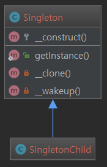

Singleton Pattern - 단일체 패턴
======================

## 의도
오직 한 개의 클래스 인스턴스만을 갖도록 보장하고, 이에 대한 전역적인 접근점을 제공합니다.

## 활용성
- 클래스의 인스턴스가 오직 하나여야 함을 보장하고, 잘 정의된 접근점으로 모든 사용자가 접근할 수 있도록 해야 할 때
- 유일한 인스턴스가 서브클래싱으로 확장되어야 하며, 사용자는 코드의 수정없이 확장된 서브클래스의 인스턴스를 사용할 수 있어야 할 때
- 웹 어플리케이션의 HTTP 요청 처리 사이클에서 특정 클래스의 인스턴스가 단 하나만 존재해야 한다는 것을 명확히 하고 싶을 때 싱글턴 패턴을 사용하면 됩니다.
  Configuration 클래스 같은 전역 개체나 이벤트 큐 같은 공유 리소스의 경우 통상적으로 그러한 성격을 띄는 경우가 많습니다.

## 주의점
싱글턴 패턴을 사용할 때 주의해야 할 것은, 패턴의 특성상 어플리케이션 전체 범위에 영향을 주는 일종의 상태 정보가 생긴다는 것입니다. 
이런 특성 때문에 테스트 가능성을 떨어뜨립니다.
대부분의 경우에는 싱글턴 클래스 대신 의존성 주입(Dependency Injection)을 사용할 수 있으므로 가능하다면 싱글턴을 피하는 편이 좋을 것입니다. 
의존성 주입을 사용하게 되면 공유되는 리소스를 사용하는 클래스라고 해도 구체적인 싱글턴 클래스의 구현에 의존적이지 않게 되므로 설계적으로 더 낫습니다.

## 예시
- DB 커넥터
- Logger (여러 목적을 위해 많은 로그파일 있는 경우, multiton 패턴일 수 있습니다.)
- 어플리케이션의 락파일 (파일시스템은 하나만 존재합니다.)

## Example01
이 코드에서는 정적(static) 변수와 정적 생성 메소드(getInstance())를 사용한 싱글턴 구현을 보여주고 있습니다.

다음 내용을 유의하세요:
- 생성자 __construct()는 new 연산자를 사용해서 다른 곳에서 함부로 생성할 수 없도록 protected 로 제한되어 있습니다.
- 특수 매서드(Magic Method) __clone()은 clone 연산자를 사용해서 복제할 수 없도록 private 으로 제한되어 있습니다.
- 특수 매서드(Magic Method) __wakeup()은 전역 함수 unserialize()를 이용해서 unserialize 할 수 없도록 private 으로 제한되어 있습니다.
- 새 인스턴스 생성 시에는 정적 메소드인 getInstance() 내에서 지연된 정적 바인딩을 통해서 생성됩니다. static 키워드가 사용되고 있는데요, 지연된 정적 바인딩을 사용함으로써 Singleton 클래스를 상속해서 싱글턴 패턴을 사용하는 자식 클래스들을 만들 수 있게 됩니다.

### UML


### output of index.php
```
bool(true)
bool(false)
bool(true)
```

## Example02

### UML


### output of Tests/SingletonTest.php
```
PHPUnit 6.5.13 by Sebastian Bergmann and contributors.

Time: 846 ms, Memory: 4.00MB

OK (1 test, 2 assertions)
```
